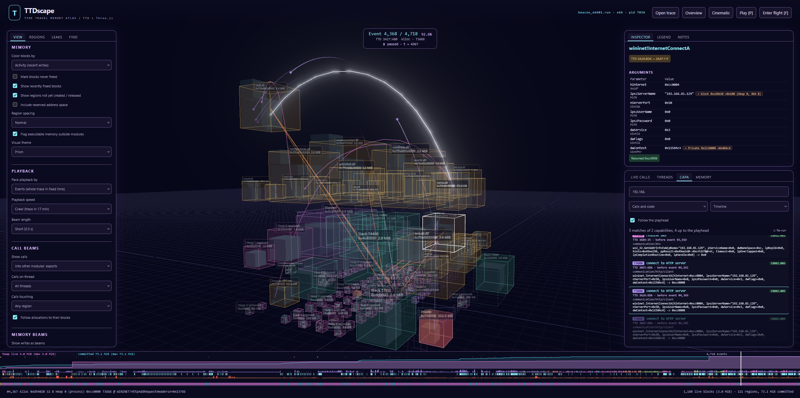

> [!Warning]
> This project was entirely generated using Claude. You may run into issues. If you do, feel 
> free to open an issue on this repository!

# TTDscape

A local, interactive 3D explorer of a process's **heap, virtual memory and API calls over time**,
built from a Microsoft **Time Travel Debugging** (TTD) recording. Scrub a timeline and watch heap
blocks, reservations, commits, protections, mapped views, images and thread stacks appear and
disappear. Calls between modules fly across the atlas as lights, one colour per thread, with their
decoded arguments, call stacks and [capa](https://github.com/mandiant/capa) capabilities, each at
its exact TTD position.

It is the time-travel counterpart of [Heapscape](https://github.com/kkokosa/heapspace), a 3D atlas
of .NET memory dumps.


## Features

- **Memory over time.** Heap blocks (volume ∝ bytes, address order) inside fixed region boxes, page
  protections, and regions created and released. The timeline plots live heap and committed memory.
- **Call beams.** Calls into other modules' exports travel from the calling code to the export,
  coloured by thread. They stay lit while the call is active, and allocation calls continue to the
  block they created. Playback can be paced by calls, a few per second, so each arc can be followed.
- **Live calls.** Every call up to the playhead with its TTD position (call → return) and decoded
  arguments: strings, flag names, `[Out]` values read at the return, and the return value. Calls
  also have symbolized call stacks.
- **CAPA.** Capabilities matched on the recorded API calls and on code the program unpacked and ran,
  with ATT&CK and MBC ids, placed where they happened.
- **Executable memory outside modules.** Regions that are not a module image but have executable
  pages (shellcode, JIT, unpacked or manually mapped code) pulse red.
- **Memory contents and accesses.** A hex view of any block or region at the playhead (unrecorded
  bytes shown as unknown, never as zeros), and its access history: every write with old → new
  values, changes made by the kernel or other threads, and reads on request, grouped by the code
  that made them. Call arguments that point into memory link to their block, and a Threads tab
  shows what each thread is calling at the playhead.
- **Memory activity (analysis option).** Blocks and pages glow with recent writes. Every block
  records who wrote it. **Write-then-execute** findings name the pages that ran code after being
  written, and the code that wrote them. Writes between regions, and the selection's loaded reads
  and writes, are drawn as straight beams. **Content search** (a second option that stores block
  snapshots) finds the blocks that held a string, some bytes or a pointer. See
  [docs/memory.md](docs/memory.md).
- **Inspection.** Symbolized allocation and free stacks, realloc chains, address history, leaks
  grouped by allocation site, a region browser with highlights, and search by address or function.



Everything stays local. The server binds to 127.0.0.1, nothing is uploaded, and traces are read in
place. The screenshots show a Cobalt Strike beacon recorded in a lab; see [SECURITY.md](SECURITY.md)
before analyzing malware.

## Requirements

- Windows x64, Visual Studio 2022 or 2026 with the C++ workload (MSVC and CMake), Node.js 22.12+.
- TTD installed (`winget install Microsoft.TimeTravelDebugging`). The build copies
  `TTDReplay.dll` / `TTDReplayCPU.dll` from it.
- NuGet package `Microsoft.TimeTravelDebugging.Apis` 0.9.5 in the NuGet cache:
  `nuget install Microsoft.TimeTravelDebugging.Apis -Version 0.9.5 -OutputDirectory %USERPROFILE%\.nuget\packages`,
  or restore it from any project. Override the location with `-DTTD_SDK_DIR=...`.
- Optional: the Windows SDK *Debugging Tools*, for a newer `dbghelp.dll` + `symsrv.dll` (symbol servers).
- Optional, for CAPA results: [ttd-capa-cpp](https://github.com/HullaBrian/ttd-capa-cpp), cloned
  and built next to this repository (or pointed to by `TTDSCAPE_TTDCAPA`). It provides
  `ttdcapa-extract.exe`, `capa-cpp.exe` and the capa rules; its README explains the build. The CAPA
  code scan writes memory snapshots of the traced process to `TTDSCAPE_CAPA_WORK` (default
  `%LOCALAPPDATA%\TTDscape\capa-work`) and deletes them afterwards. Exclude that folder from
  antivirus scanning.

## Quick start

```powershell
git clone https://github.com/HullaBrian/ttdscape.git
cd ttdscape
powershell -ExecutionPolicy Bypass -File .\Start.ps1 -SymbolPath "srv*C:\symbols*https://msdl.microsoft.com/download/symbols"
```

`Start.ps1` builds the analyzer and the viewer on first run, then starts the server. Open
http://127.0.0.1:5177, click **Open trace**, pick a `.run` file, and **Analyze**. Files in
`traces\` and `fixtures\traces\` are listed, or paste any local path. To record a trace, see
[traces/README.md](traces/README.md).

Without `-SymbolPath` (or `_NT_SYMBOL_PATH`), symbolization is local only. Modules whose exact build
is on disk, and your own PDBs, resolve; others show as `module+0xRVA`. Frames outside every module
are labelled **(unbacked)**, the signature of JIT code, shellcode and manually mapped images.

### Viewer controls

| | |
|---|---|
| Timeline | drag to scrub, wheel to zoom, double-click to reset; lanes show call rate (by thread) and CAPA matches |
| ← / → | step one event (Ctrl: 100) |
| Shift + ← / → | previous / next event touching the selected block (same address) or region; markers otherwise |
| Home / End, P | start / end, play |
| Mouse | orbit / pan / zoom; click selects; F flight mode (WASD/QE, Space slow, Shift fast), G focus, X clear |
| Cinematic ▾ | slow, looping camera moves with the panels hidden: **Tour the regions** glides past the most prominent regions; **Aerial orbit** circles above the atlas with every region in view. **Keep calls, CAPA and threads** (on by default) leaves the Live calls / Threads / CAPA / Memory panel on screen and usable, and centres the view in the space left. P still plays the trace; a click on the view, the wheel, a camera key, Esc or Stop in the menu ends it where it is |
| Time HUD | the playhead's event number, TTD position (`Sequence:Steps`, usable in WinDbg with `!tt`), event kind and thread, playback speed |
| View tab | block colours and memory options; **playback pacing** by events (the whole trace in a fixed time, down to 83 min) or by calls (a fixed number per second, down to one every 2 s); beam length; which calls to draw (other modules' exports, any export, or none; by thread; only those touching the selection or highlighted regions); allocation legs; the executable-memory alert |
| Regions tab | every region, filterable by name, address, kind, or ⚠ executable memory outside modules; checkboxes highlight regions, optionally dimming the rest (remembered per analysis) |
| Live calls tab | calls up to the playhead with TTD positions and decoded arguments; hover for the call stack, click for all parameters, the full stack, and jumps to the call and its return |
| Threads tab | each thread's calls into exports in progress at the playhead, innermost first, with arguments |
| View tab: memory | block colours (including **Activity**), **region spacing** (compact, normal, wide), **memory beams** (writes between regions; the selection's loaded accesses) |
| Memory tab | the selected block, region or page range (or a typed address) at the playhead: hex and ASCII, tinted by when each byte was recorded, `··` for unrecorded bytes, changed bytes flash, strings; click and shift-click bytes to select them |
| Accesses (Inspector) | **Load writes** for a block, region or selected bytes: who wrote it (grouped by function, or unbacked region), old → new values, TTD positions; optionally reads. Timeline ticks; `[` / `]` step between accesses |
| CAPA tab | capabilities as a timeline that follows the playhead, or grouped by capability; click a match to jump to it and open its call; **Run CAPA** adds results to an older analysis |
| Beams | hover a head for caller → export (or allocation → block); click it to open the call |
| Side rails | tabs; drag a rail's inner edge to resize it |

### Command line

```text
ttdscape-analyzer info      <trace.run>                 trace summary (threads, modules, lifetime)
ttdscape-analyzer probe     <trace.run>                 measures CALL/RET register conventions
ttdscape-analyzer analyze   <trace.run> <outDir> [--stack-depth N] [--no-symbols] [--symbol-path P]
                                                        [--index keep|temp] [--seek-budget N] [--calls exports|none]
                                                        [--call-args on|off] [--win32-index P] [--debug-ndjson]
                                                        [--activity off|codefetch|execute] [--snapshots off|on|BYTES]
ttdscape-analyzer symbolize <outDir> [--symbol-path P]  re-run symbolization only
ttdscape-analyzer serve     <trace.run> <outDir>        query service for memory and accesses (NDJSON on stdin/stdout)
```

The server reads its settings from the environment:

| Variable | Default | Purpose |
|---|---|---|
| `TTDSCAPE_PORT` | `5177` | Listening port (always on 127.0.0.1) |
| `TTDSCAPE_CACHE` | `%LOCALAPPDATA%\TTDscape\cache` | Analysis results |
| `TTDSCAPE_SYMBOL_PATH` | `_NT_SYMBOL_PATH` | DbgHelp symbol path |
| `TTDSCAPE_TRACE_ROOTS` | none | `;`-separated directories that traces must live under |
| `TTDSCAPE_BROWSE` | `traces;fixtures\traces` | Directories listed in the Open dialog |
| `TTDSCAPE_TTDCAPA` | `..\ttd-capa-cpp` | ttd-capa-cpp checkout for CAPA results |
| `TTDSCAPE_CAPA_WORK` | `%LOCALAPPDATA%\TTDscape\capa-work` | CAPA scratch space (memory snapshots) |

## How the analysis works

1. **Hook resolution.** The export table of the *recorded* ntdll is read from trace memory, because
   a disk copy of a different build would give wrong RVAs. The fallbacks are the disk image with a
   matching timestamp and size, then the symbol server. Hooked functions:
   - heap: `RtlAllocateHeap`, `RtlFreeHeap`, `RtlReAllocateHeap`, `RtlCreateHeap`, `RtlDestroyHeap`;
   - virtual memory: `NtAllocateVirtualMemory(Ex)`, `NtFreeVirtualMemory`, `NtProtectVirtualMemory`,
     `NtMapViewOfSection(Ex)`, `NtUnmapViewOfSection(Ex)`.
2. **Capture (one replay).**
   - CALL/RET callbacks maintain a per-thread shadow stack.
   - Execute watchpoints on the hooked entries catch every entry, including tail jumps.
   - RETs pair with their frame by return-address slot.
   - A gap callback counts kernel calls and flags syscalls issued from outside ntdll/win32u.
3. **Syscall out-parameters.** A kernel write (`*BaseAddress`, `*RegionSize`, `*OldProtect`) is often
   invisible at the RET. Values are taken, in order, from:
   - the kernel's fixed rounding rules;
   - the value at the RET, if it passes an invariant;
   - a read-back retried on later callbacks of the same thread;
   - a bounded seek with `InFragmentAggressive`.

   A value is never taken from the caller's pre-call contents. `manifest.json → quality` reports
   where each value came from.
4. **Models.**
   - **Heap.** Block lifetimes, including realloc chains, `HeapDestroy` implicit frees, blocks freed
     but allocated before the trace, double frees, and cross-thread frees. Same-heap nested calls
     (the LFH allocating its own subsegments) are folded into the outer call.
   - **Virtual memory.** Regions (private, mapped, image, stack, heap segment, inferred pre-trace)
     with page spans `[start,end) × (state, protect)` valid over `[startEvt, endEvt)`, so "the
     address space at event i" is a plain stabbing query.
5. **Calls into exports**, recorded in the same replay, with arguments decoded by
   [ttd-capa-cpp](https://github.com/HullaBrian/ttd-capa-cpp)'s decoder (vendored) and each caller's
   stack. This costs about 0.4 s to read the export tables and about 300 ms of capture on a
   100k-call trace. See [docs/calls.md](docs/calls.md).
6. **Symbols.** DbgHelp resolves each unique frame against the module loaded at its recorded base.
7. **CAPA** (optional). The server runs ttd-capa-cpp's extractor and capa-cpp on the trace, and
   places every match on the timeline.

[ReplayAPI.md](ReplayAPI.md) is a practical guide to the TTD Replay API, with the corrections found
while building this (for example, a callback-only cursor needs `ReplayAllSegmentsWithoutFiltering`,
and a RET pairs with its CALL by stack pointer).

## Output format (`<cache>/<id>/`)

`manifest.json` holds trace info, counts, the file table, threads, heaps, modules, markers, hooks,
quality and warnings. Addresses are `"0x…"` strings; `null` means none.

The binary tables are little-endian, fixed-size records (see `analyzer/src/model/types.h`):

| File | Record | Fields |
|---|---|---|
| `events.bin` | 32 B | kind u8, flags u8, thread u16, id u32, addr u64, size u64, stack u32, aux u32 |
| `positions.bin` | 16 B | TTD `Sequence:Steps`, parallel to events (fetched lazily) |
| `blocks.bin` | 48 B | addr, size, heap, allocEvt, freeEvt, allocStack, freeStack, prev, flags, threads |
| `regions.bin` | 48 B | base, size, kind, createEvt, releaseEvt, owner (heap/module/thread), stacks, flags |
| `spans.bin` | 40 B | start, end, region, state, protect, startEvt, endEvt |
| `stacks.bin` / `frames.bin` | 8 B / 16 B | stack trie (parent, frame) / frame (address, module, rva) |
| `series.bin` | f64 columns | heap live/peak/blocks, committed, reserved, mapped, allocs, frees |
| `calls.bin` | 32 B | thread u16, flags u8 (returned/unwound/tail/same-module), depth u8, callerFrame u32, callee u32, startEvt u32, endEvt u32, startFrac f32, endFrac f32, via u32 |
| `callpos.bin` | 32 B | TTD position of each call and of its return (u64 seq, u64 steps each; all ones = never returned) |
| `callstacks.bin` | 4 B | `stacks.bin` node of each call's stack (the caller's return address first) |
| `callargs.bin` / `callargs.jsonl` | u64 / text | byte offset of each call's line (plus the end) / one JSON object per call with its decoded arguments (keys in `analyzer/src/replay/call_args.h`) |
| `activity.bin` | 20 B | (with `--activity`) block u32, region u32, page u32, bucket u32, writes u32 |
| `writers.bin` | 40 B | (with `--activity`) per written block or page: first and last writer frame, event and thread, writes, flags |
| `contents.idx` / `contents.bin` | 16 B / bytes | (with `--snapshots`) per block: offset u64, length u32, unknown bytes u32 / its first 4 KiB as last seen |

`symbols.json` is `{"frames": [[symbol, file, line], …]}`, indexed like `frames.bin`.
`callees.json` is `{"callees": [[module, name, "0x…"], …]}`, the called exports that `calls.bin`
indexes. `capa.json` holds the CAPA results:
- `rules`: name, namespace, ATT&CK and MBC;
- `rows`: rule, source (call or code), TTD position, event and thread, and the triggering call or
  code site;
- `scope`: rules without a single position.

When CAPA could not run, it holds `available: false` and a reason. `wx.json` holds the
write-then-execute findings (see [docs/memory.md](docs/memory.md)).

The timeline axis is the **event index**. Events are sorted by TTD position:
- frees are placed at their CALL;
- allocations and memory syscalls at their RET.

A call happens at `startEvt - 1 + startFrac` on that axis and returns at `endEvt - 1 + endFrac`.

## Tests

```powershell
ctest --test-dir build\analyzer -C RelWithDebInfo     # analyzer unit tests (models, shadow stack, calls, out-params, PE, writer)
npm test                                              # viewer data layer + server (fake analyzer)
npm run test:integration                              # real analyzer on traces\*.run and the fixture; the CAPA pass
node tests\e2e\screenshot.mjs <analysisId>            # headless Edge screenshots of a loaded analysis
node tests\e2e\features.mjs <analysisId>              # regions, pacing by calls, live calls, arguments, CAPA
node tests\e2e\memory.mjs <analysisId>                # threads, pointer links, the Memory tab, access history
node tests\e2e\activity.mjs <analysisId>              # activity colours, write-then-execute, content search (needs both options)
```

The **fixture** (`fixtures/app/fixture.cpp`) runs a scripted sequence and writes its own ground truth
(every address it received). The sequence covers:
- private heaps, and realloc in place, moving and failing;
- HeapDestroy with live blocks, CRT allocators and leaks;
- the VirtualAlloc lifecycle, including an unaligned commit and OldProtect;
- mapped views and frees across threads;
- an allocation inside an exception unwind and one through a tail-call wrapper.

Recordings are not part of the repository; create them as described in
[fixtures/traces/README.md](fixtures/traces/README.md). The integration tests then check the model,
and the decoded `HeapAlloc` arguments, against the truth exactly. Tests whose recordings or tools
are missing are skipped.

## Limitations

- x64 and x86 (WoW64) guests. ARM64 traces are rejected.
- Only the native NT heap API and memory syscalls are modelled. Custom allocators that carve up
  `VirtualAlloc` memory show as committed pages, not blocks; the .NET GC heap likewise shows as pages.
- Syscalls made from outside ntdll/win32u (direct syscalls) are counted and shown on the timeline,
  but their effects on memory are not modelled.
- Block sizes are the requested sizes. Heap metadata and LFH subsegments are not drawn as blocks.
- Calls are recorded only when they target a module export (see [docs/calls.md](docs/calls.md) for
  open work). Structure and COM arguments are not expanded.

## Contributing

See [CONTRIBUTING.md](CONTRIBUTING.md). The viewer is an app core plus features, described in
[docs/viewer-architecture.md](docs/viewer-architecture.md). [CLAUDE.md](CLAUDE.md) is a quick start
for coding agents.

## License and credits

TTDscape is released under the [MIT License](LICENSE).
[THIRD_PARTY_NOTICES.md](THIRD_PARTY_NOTICES.md) lists the work it includes or adapts:
- Parts of the viewer come from [Heapscape](https://github.com/kkokosa/heapspace) by Konrad Kokosa
  (MIT).
- API argument decoding comes from [ttd-capa-cpp](https://github.com/HullaBrian/ttd-capa-cpp)
  (Apache-2.0), with signature data from win32json and phnt (MIT).
